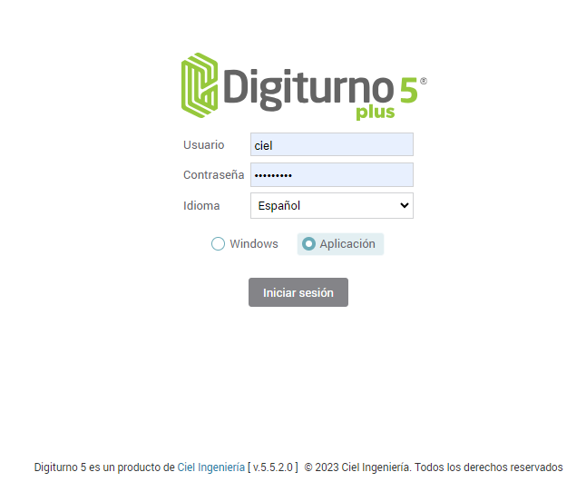

# **Automatización Digiturno plus 5.5.0.0 en adelante**

## Descripción del Proyecto

En el presente proyecto, se realiza la automatización para la aplicación Digiturno de propiedad de **Ciel Ingeniería SAS**, en ella se realiza una automatización mediante **Katalon Studio**.

Cabe señalar, que esta es una automatización de creación Tomando en cuenta tres aspectos:

1. Wizard de Creación. 
2. Actualizaciones.
3. Operaciones Básicas en Terminal.
4. Video Atención.

## Que necesitan para poder automatizar

Para poder automatizar necesitan descargar Katalon Studio del siguiente enlace:

[https://katalon.com/download](https://katalon.com/download)

**Para poder usarlo se necesita crear una cuenta, que es gratuita, mediante correo y contraseña.**

## Funcionalidades Wizard de Creación
| Id   | Proceso                                    | Descripción                                                      |
|------|--------------------------------------------|------------------------------------------------------------------|
| 1    | Crear Niveles                              | Crea los niveles Área, Tipo de Cliente, Servicios y Subservicios |
| 2.1  | Creación Elemento de Área                  |                                                                  |
| 2.2  | Creación Elementos Tipo Cliente            |                                                                  |
| 2.3  | Creación Elementos Servicios               |                                                                  |
| 2.4  | Creación elementos Subservicios            |                                                                  |
| 3.1  | Agregar al árbol área                      |                                                                  |
| 3.2  | Agregar al árbol Tipo Cliente              |                                                                  |
| 3.3  | Agregar al árbol Servicios                 |                                                                  |
| 3.4a | Agregar al árbol Subservicios Información  |                                                                  |
| 3.4b | Agregar al árbol Subservicios Radicaciones |                                                                  |
| 3.4c | Agregar al árbol Subservicios PQRS         |                                                                  |
| 3.5  | Creación Colas                             |                                                                  |
| 4    | Crear Niveles Geográficos                  | Se crean los Niveles geográficos: País, Departamento y Ciudad    |
|4.1|	Crear Elemento Geográfico País	|
|4.2|	Crear Elementos Geográficos Departamentos|	
|4.3|	Crear Elementos Geográficos Ciudades	|
|5.1|	Crear Oficinas|	Crea Oficinas: CIEL, Chipichape, Bocagrande, Manizales, Laureles, Virtual y WorkFlow|
|5.2|	Crear Salas	|
|5.3|	Crear Grupos|	
|5.4|	Crear y Relacionar Selectores|	
|5.5|	Crear Terminales|	
|5.6|	Creación, Relación y columnas de Tableros|	
|5.7|	Crear Motivos|	Motivos de cierre, Suspensión y cancelación de servicio|  
|5.8|	Motivos por Oficinas|	Relaciona los motivos creados|
|6|	Configuración Terminales y Selectores	|

## Funcionalidades Actualizaciones
| Id  | Pagina                              | Descripción Pagina                                                                                                                                                          |
|-----|-------------------------------------|-----------------------------------------------------------------------------------------------------------------------------------------------------------------------------|
| 1   | Inicio                              | Página de Inicio                                                                                                                                                            |
| 3   | Configuración                       | Acceso a las opciones de configuración                                                                                                                                      |
| 5   | Seguridad                           | Seguridad del sistema                                                                                                                                                       |
| 11  | Páginas Activar Desactivar          | Disposición del menú de la organización                                                                                                                                     |
| 13  | Perfiles                            | Perfiles de usuario                                                                                                                                                         |
| 14  | Páginas por Perfil                  | Asignación de páginas por perfil de usuario                                                                                                                                 |
| 15  | Consultar Usuarios                  | Permite ver los usuarios creados en el sistema                                                                                                                              |
| 16  | Agregar Usuarios                    | Permite crear un usuario en el sistema                                                                                                                                      |
| 17  | Editar Usuarios                     | Permite editar un usuario del sistema                                                                                                                                       |
| 21  | Distribución geográfica             | Distribución geográfica del sistema                                                                                                                                         |
| 23  | Oficinas                            | Configuración de oficinas                                                                                                                                                   |
| 24  | Salas                               | Configuración de salas                                                                                                                                                      |
| 25  | Grupos                              | Configuración de grupos                                                                                                                                                     |
| 29  | Usuarios                            | Usuarios del sistema                                                                                                                                                        |
| 30  | Sistema                             | Configuraciones de sistema                                                                                                                                                  |
| 31  | Jornadas de Atención                | Configuración de jornadas de atención                                                                                                                                       |
| 32  | Elementos del sistema               | Describe la lista de elementos del sistema para ser configurados                                                                                                            |
| 33  | Terminales                          | Configuración de las terminales del sistema                                                                                                                                 |
| 34  | Niveles geográficos                 | Configuración de los niveles geográficos del sistema                                                                                                                        |
| 35  | Usuarios por Terminales             | Relaciona los usuarios con las terminales (Selectores y Servidores)                                                                                                         |
| 36  | Alarmas                             | Alarmas del sistema                                                                                                                                                         |
| 38  | Selectores                          | Configuración de los selectores del Sistema                                                                                                                                 |
| 39  | Modelo de atención                  | Describe el modelo de atención del sistema                                                                                                                                  |
| 40  | Jerarquía y Colas                   | Jerarquía del modelo de atención                                                                                                                                            |
| 41  | Numeradores                         | Numeradores del sistema para identificación de colas.                                                                                                                       |
| 42  | Prioridades                         | Configuración de los modelos de prioridad el sistema                                                                                                                        |
| 43  | Calificación                        | Configuración de las preguntas y respuestas a calificar                                                                                                                    |
| 55  | Tableros                            | Configuración de los tableros del sistema                                                                                                                                   |
| 59  | Datos Complementarios               | Pagina de acceso a información cliente y campos adicionales                                                                                                                 |
| 60  | Información Clientes                | Configuración de información del cliente que se muestra en la terminal o el selector y se tiene en cuenta para habilitar el origen de creación del usuario-cliente           |
| 61  | Campos Adicionales                  | Configuración y creación de campos adicionales                                                                                                                              |
| 62  | Autorización Personalizada          | Administra la configuración personalizada de los controles y sus acciones en las páginas                                                                                    |
| 66  | Motivos                             | Administración de motivos de cierre, suspensión y cancelación de turno y servicio                                                                                           |
| 67  | Administración Redes                | Para la creación, modificación y eliminación de las redes                                                                                                                   |
| 68  | Administración Impresoras           | Página de configuración para las impresoras y tiquetes                                                                                                                      |
| 70  | Usuario por Perfil                  | Página de usuarios por perfil                                                                                                                                               |
| 79  | Parámetros generales                | Página de parámetros generales                                                                                                                                              |
| 81  | Módulos y personalizaciones         | Configuración de módulos del sistema y personalizaciones de cliente                                                                                                         |
| 90  | Administración rápida de terminales | Abre la página principal de administración rápida de terminales.                                                                                                            |
| 97  | Sistema Alarmas                     | Administración y configuración del sistema de alarmas que se encuentran asociadas al modulo SPN con alarmas al correo, SMS y en la terminal(Terminal requiere instalar MPC) |
| 98  | Kioscos                             | Configuración de Kioscos para operar con video atención Virtual-presencial o por servicios (direcTV)                                                                        |
| 100 | Administración DigiBeep             | Administración y configuración del sistema de DigiBeeps                                                                                                                     |
| 101 | Logs de sistema                     | Permite visualizar los logs de sistema                                                                                                                                      |
| 106 | Notificaciones                      | Página de configuración de notificaciones modal, auditivas, popup y en pantalla                                                                                            |
| 107 | Atributos                           | Página de configuración de niveles y atributos de usuario                                                                                                                   |
| 109 | Política Datos                      | Política de tratamiento de datos                                                                                                                                            |
| 110 | Política Datos                      | Política de tratamiento de datos                                                                                                                                            |

## Funcionalidades Operaciones Básicas en Terminal
| Id | Proceso                 | Descripción                                            |
|----|-------------------------|--------------------------------------------------------|
| 1  | Generar Turno           | Abrir Selector y generar un total de 9 turnos          |
| 2  | Llamar Turno            | Abrir Terminal Llamar Turno y Mandar a ocupado         |
| 3  | Suspender Turno         | Abrir Terminal, suspender turno                        |
| 4  | Distraer Turno          | Abrir Terminal, mandar a distraído                     |
| 5  | Cancelación Transacción | Abrir Terminal, cancelar transacción                   |
| 6  | Buscar Turno            | Abrir Terminal buscar turno y llamar                   |
| 7  | Detalle Turno           | Abrir Terminal atender un turno y mostrar sus detalles |
| 8  | Reclasificar Turno      | Abrir Terminal, atender turno y reclasificar           |
| 9  | Nueva Transacción Turno | Abrir Terminal atender y realizar nueva transacción    |
| 10 | Transferencia Turno     | Abrir Terminal, llamar y transferir el turno.          |

## Funcionalidades Video Atención

| Id | Proceso                             | Descripción                                                                              |
|----|-------------------------------------|------------------------------------------------------------------------------------------|
| 1  | Abrir Video Atención                | Abrir Video Atención Cliente                                                             |
| 2  | Abrir Terminal para Video Atención  | Abrir Terminal debe mostar el mensaje Video Atención habilitado                          |
| 3  | Atención Turno en la Terminal       | Mostrar Video en la terminal                                                             |
| 4  | Atención en Cliente                 | Mostrar Video en el navegador del Cliente                                                |
| 5  | Cliente deshabilitar Video          | En el navegador del cliente Deshabilitar el video                                        |
| 6  | Cliente deshabilitar audio          | En el navegador del cliente deshabilitar el micrófono                                    |
| 7  | Cliente deshabilitar Audio y Video  | En el navegador del cliente deshabilitar el micrófono y el video                         |
| 8  | Terminal deshabilitar video         | En la terminal deshabilitar video                                                        |
| 9  | Terminal deshabilitar audio         | En la terminal deshabilitar el micrófono                                                 |
| 10 | Terminal deshabilitar Audio y Video | En la terminal deshabilitar el micrófono y el video                                      |
| 11 | Cliente Transferir Archivos         | Enviare un archivo del cliente y verificar su recepción en la terminal (TXT, PDF y PNG)  |
| 12 | Terminal Transferir Archivos        | Enviar un archivo de la terminal y verificar su recepción en el cliente (TXT, PDF y PNG) |
| 13 | Cliente Reenviar Archivo            | Hacer click en el botón reenviar                                                         |
| 14 | Cliente Eliminar Archivo            | Eliminar el archivo enviado                                                              |
| 15 | Cliente Ver archivo                 | Hacer click en el botón Ver                                                              |

## Autor del proyecto

Jaime Enrique Dávila Zuazo

***Analista en Automatizaciones***