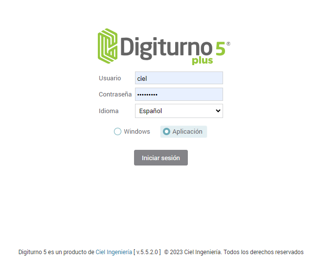
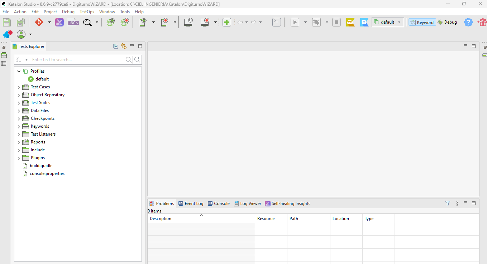
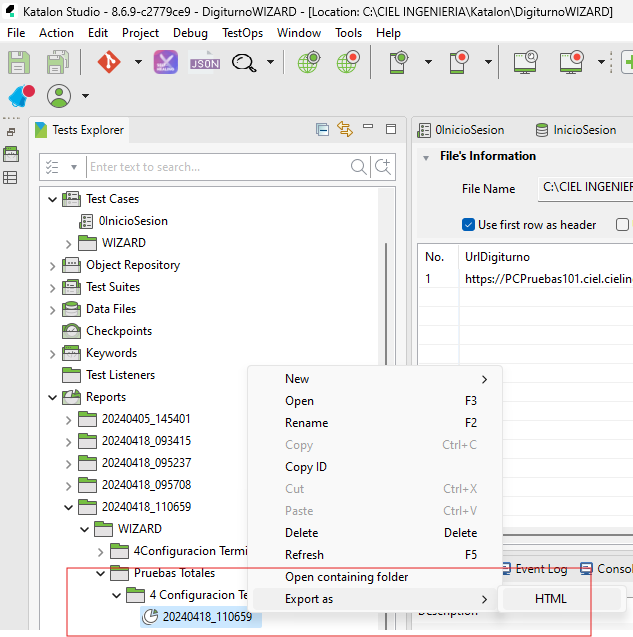

# **Automatización Digiturno plus 5.5.0.0 en adelante**

## Descripción del Proyecto

En el presente proyecto, se realiza la automatización para la aplicación Digiturno de propiedad de **Ciel Ingeniería SAS**, en ella se realiza una automatización mediante **Katalon Studio**.

Cabe señalar, que esta es una automatización va después del wizard de creación Tomando en cuenta dos aspectos:

1. Actualizaciones.
2. Operaciones Básicas en Terminal.

## Que necesitan para poder automatizar

Para poder automatizar necesitan descargar Katalon Studio del siguiente enlace:

[https://katalon.com/download](https://katalon.com/download)

**Para poder usarlo se necesita crear una cuenta, que es gratuita, mediante correo y contraseña.**

## Explicación Proyecto en Katalon

Al abrir el proyecto se tendrá la siguiente pantalla principal:

* **Profiles:** En el perfil Default, en algunos proyectos se utilizan variables globales a ser usadas para la automatización (URL, Usuarios, contraseñas). 
* **Test Cases:** En esta carpeta se encuentran los caso de prueba individuales.
* **Object Repository:** En esta carpeta se encuentran los objetos (elementos) que se utilizan para crear los test cases, Ellos tienen la facilidad de ser encontrados ya sea su id, Xpath, atributos, esto para facilitar su uso.
* **Test Suites:** En esta carpeta, se encuentran los casos de pruebas que generan reportes (HTML,PDF), es decir que esta es la carpeta para explorar cuando se van a realizar casos de prueba completos.
* **Data Files:** En esta carpeta se encuentran los datos que son ingresados mediante un archivo Excel a la aplicación, como ser: datos de URL para ingresar, usuario, contraseñas y otros datos que sirven para que los casos de pruebas se realicen sin intervención manual.
* **Reports:** En esta carpeta se almacenan los reportes que se generan al ejecutar los Test Suites.

### Ejecutar Test Case o Test Suite

Para ejecutar un test case u un test suite, basta con dar doble click el archivo para abrirlo y posteriormente se da click en el botón de Play verde. como se indica en la imagen.

### Data Files

Si deseamos modificar las URL de ingreso a las aplicaciones o contraseñas de inicios de sesión, lo podremos hacer en la carpeta **Data Files**, en los archivos correspondientes. Al hacer un cambio siempre se debe guardar el proyecto haciendo click en el disco (Esquina superior izquierda).

### Reportes

Al ejecutar los Test Suites, se generarán reportes de manera automática, generando el nombre mediante la fecha en que fue realizado y un número correlativo. Al hacer click derecho sobre el mismo dará la opción de exportar el reporte y descargarlo en HTML y en algunos casos en PDF, como muestra la imagen.

## Funcionalidades Actualizaciones
| Id  | Pagina                              | Descripción Pagina                                                                                                                                                          |
|-----|-------------------------------------|-----------------------------------------------------------------------------------------------------------------------------------------------------------------------------|
| 1   | Inicio                              | Página de Inicio                                                                                                                                                            |
| 3   | Configuración                       | Acceso a las opciones de configuración                                                                                                                                      |
| 5   | Seguridad                           | Seguridad del sistema                                                                                                                                                       |
| 11  | Páginas Activar Desactivar          | Disposición del menú de la organización                                                                                                                                     |
| 13  | Perfiles                            | Perfiles de usuario                                                                                                                                                         |
| 14  | Páginas por Perfil                  | Asignación de páginas por perfil de usuario                                                                                                                                 |
| 15  | Consultar Usuarios                  | Permite ver los usuarios creados en el sistema                                                                                                                              |
| 16  | Agregar Usuarios                    | Permite crear un usuario en el sistema                                                                                                                                      |
| 17  | Editar Usuarios                     | Permite editar un usuario del sistema                                                                                                                                       |
| 21  | Distribución geográfica             | Distribución geográfica del sistema                                                                                                                                         |
| 23  | Oficinas                            | Configuración de oficinas                                                                                                                                                   |
| 24  | Salas                               | Configuración de salas                                                                                                                                                      |
| 25  | Grupos                              | Configuración de grupos                                                                                                                                                     |
| 29  | Usuarios                            | Usuarios del sistema                                                                                                                                                        |
| 30  | Sistema                             | Configuraciones de sistema                                                                                                                                                  |
| 31  | Jornadas de Atención                | Configuración de jornadas de atención                                                                                                                                       |
| 32  | Elementos del sistema               | Describe la lista de elementos del sistema para ser configurados                                                                                                            |
| 33  | Terminales                          | Configuración de las terminales del sistema                                                                                                                                 |
| 34  | Niveles geográficos                 | Configuración de los niveles geográficos del sistema                                                                                                                        |
| 35  | Usuarios por Terminales             | Relaciona los usuarios con las terminales (Selectores y Servidores)                                                                                                         |
| 36  | Alarmas                             | Alarmas del sistema                                                                                                                                                         |
| 38  | Selectores                          | Configuración de los selectores del Sistema                                                                                                                                 |
| 39  | Modelo de atención                  | Describe el modelo de atención del sistema                                                                                                                                  |
| 40  | Jerarquía y Colas                   | Jerarquía del modelo de atención                                                                                                                                            |
| 41  | Numeradores                         | Numeradores del sistema para identificación de colas.                                                                                                                       |
| 42  | Prioridades                         | Configuración de los modelos de prioridad el sistema                                                                                                                        |
| 43  | Calificación                        | Configuración de las preguntas y respuestas a calificar                                                                                                                    |
| 55  | Tableros                            | Configuración de los tableros del sistema                                                                                                                                   |
| 59  | Datos Complementarios               | Pagina de acceso a información cliente y campos adicionales                                                                                                                 |
| 60  | Información Clientes                | Configuración de información del cliente que se muestra en la terminal o el selector y se tiene en cuenta para habilitar el origen de creación del usuario-cliente           |
| 61  | Campos Adicionales                  | Configuración y creación de campos adicionales                                                                                                                              |
| 62  | Autorización Personalizada          | Administra la configuración personalizada de los controles y sus acciones en las páginas                                                                                    |
| 66  | Motivos                             | Administración de motivos de cierre, suspensión y cancelación de turno y servicio                                                                                           |
| 67  | Administración Redes                | Para la creación, modificación y eliminación de las redes                                                                                                                   |
| 68  | Administración Impresoras           | Página de configuración para las impresoras y tiquetes                                                                                                                      |
| 70  | Usuario por Perfil                  | Página de usuarios por perfil                                                                                                                                               |
| 79  | Parámetros generales                | Página de parámetros generales                                                                                                                                              |
| 81  | Módulos y personalizaciones         | Configuración de módulos del sistema y personalizaciones de cliente                                                                                                         |
| 90  | Administración rápida de terminales | Abre la página principal de administración rápida de terminales.                                                                                                            |
| 97  | Sistema Alarmas                     | Administración y configuración del sistema de alarmas que se encuentran asociadas al modulo SPN con alarmas al correo, SMS y en la terminal(Terminal requiere instalar MPC) |
| 98  | Kioscos                             | Configuración de Kioscos para operar con video atención Virtual-presencial o por servicios (direcTV)                                                                        |
| 100 | Administración DigiBeep             | Administración y configuración del sistema de DigiBeeps                                                                                                                     |
| 101 | Logs de sistema                     | Permite visualizar los logs de sistema                                                                                                                                      |
| 106 | Notificaciones                      | Página de configuración de notificaciones modal, auditivas, popup y en pantalla                                                                                            |
| 107 | Atributos                           | Página de configuración de niveles y atributos de usuario                                                                                                                   |
| 109 | Política Datos                      | Política de tratamiento de datos                                                                                                                                            |
| 110 | Política Datos                      | Política de tratamiento de datos                                                                                                                                            |

## Funcionalidades Operaciones Básicas en Terminal
| Id | Proceso                 | Descripción                                            |
|----|-------------------------|--------------------------------------------------------|
| 1  | Generar Turno           | Abrir Selector y generar un total de 9 turnos          |
| 2  | Llamar Turno            | Abrir Terminal Llamar Turno y Mandar a ocupado         |
| 3  | Suspender Turno         | Abrir Terminal, suspender turno                        |
| 4  | Distraer Turno          | Abrir Terminal, mandar a distraído                     |
| 5  | Cancelación Transacción | Abrir Terminal, cancelar transacción                   |
| 6  | Buscar Turno            | Abrir Terminal buscar turno y llamar                   |
| 7  | Detalle Turno           | Abrir Terminal atender un turno y mostrar sus detalles |
| 8  | Reclasificar Turno      | Abrir Terminal, atender turno y reclasificar           |
| 9  | Nueva Transacción Turno | Abrir Terminal atender y realizar nueva transacción    |
| 10 | Transferencia Turno     | Abrir Terminal, llamar y transferir el turno.          |

## Autor del proyecto

Jaime Enrique Dávila Zuazo

***Analista en Automatizaciones***
